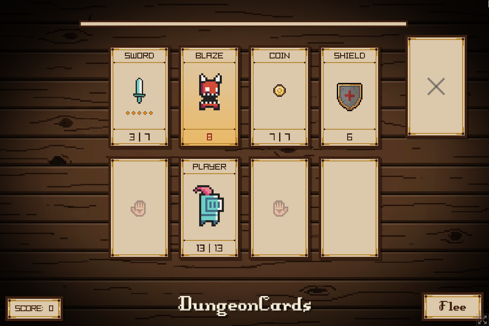
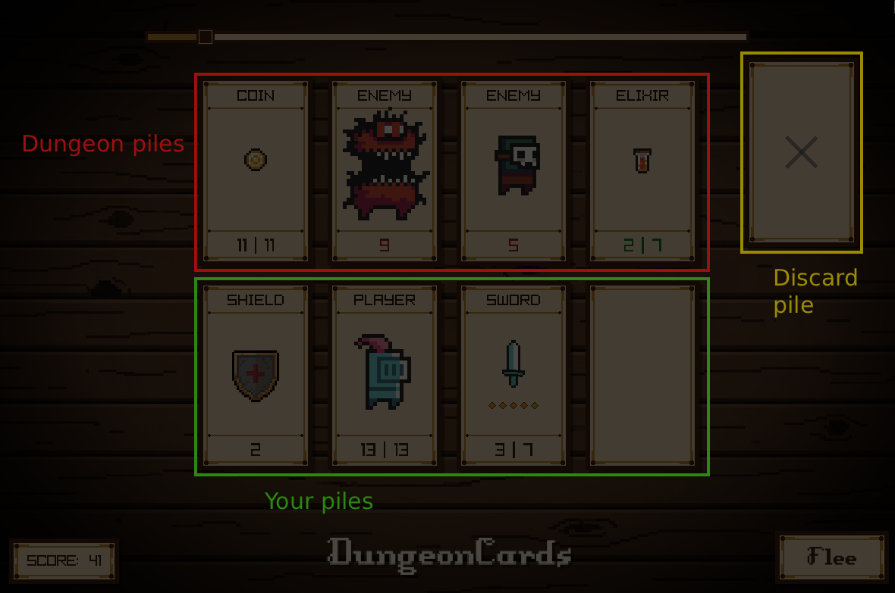
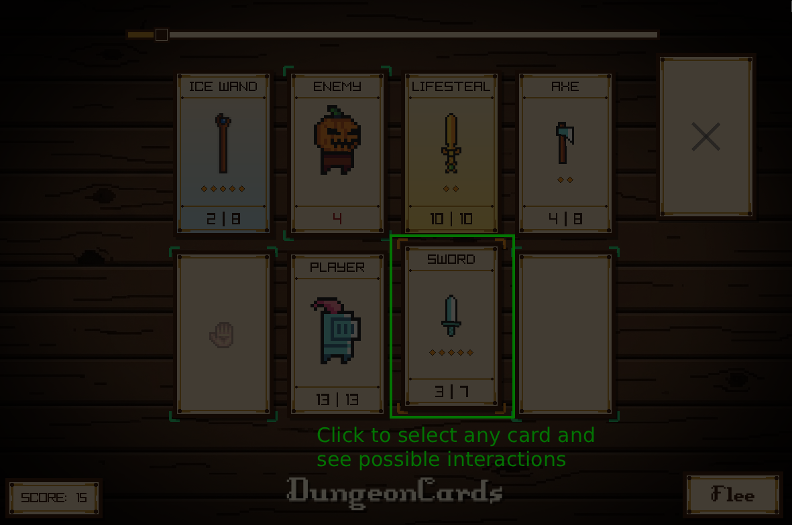
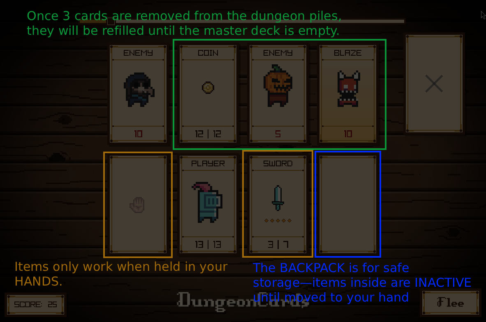

# DungeonCards


<p align="center">
  <strong>Welcome to DungeonCards.</strong>
</p>

A minimalist, strategic card-based roguelike dungeon crawler built from scratch in C++ using the Raylib library.

## Play Now

You don't need to compile the project to play it. The game has been compiled to WebAssembly (WASM) and is available to play directly in your browser:

**[Play DungeonCards on itch.io](https://asom846.itch.io/dungeoncards)**

_On the itch.io page, you will also find more detailed information about the gameplay rules, card mechanics, and future updates._

## Building the project

### arch linux

If you prefer to build the game locally, follow the instructions below.

```bash
  sudo pacman -Syu --needed git base-devel cmake ninja ccache sccache pkgconf raylib
  git clone https://github.com/ASOM846/DungeonCards.git
  cd DungeonCards
  cmake -S . -B build -G Ninja
  cmake --build build --parallel $(nproc)
```

Run the game using
`./build/dungeoncards`

## Screenshots



## How to play

### This section contains screenshots from `How to play` menu from the game and more detailed instructions

> **Important Backpack & Item Rules:**
>
> - **Backpack Items:** Cards in your backpack are **inactive**. To use them, you must first move them to an empty hand or swap them with an active hand card.
> - **Special Items (Anvil / Fire & Ice Elixirs):** These items cannot be targeted directly. You must **select the item first**, and then click on your desired target to apply the effect.



#### Overall look

- Dungeon Piles
- Your piles
  - Left hand pile
  - Player card
  - Right hand pile
  - Backpack pile
- Discard pile (can be used to discard unused items)



#### Interacting

- select first card, it will be marked with orange boundary
- Cards that selected card can interact with will be marked with green boundary
- Click again now on one of the highlited cards
- Discard pile won't be highlited, you can discard any player friendly card
- Clicking anywhere else on the screen will result in unselection of selected card

There are many interaction so... mess with it:D


